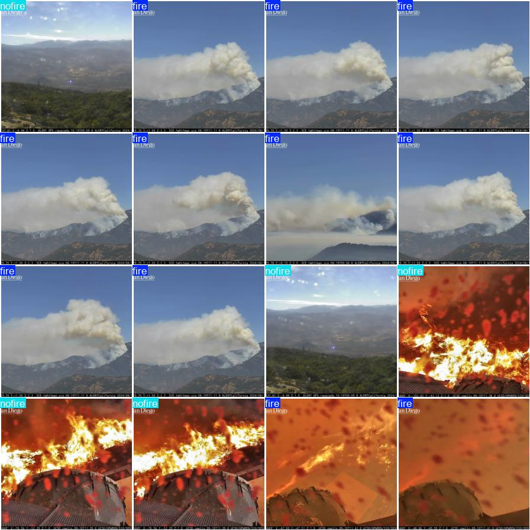
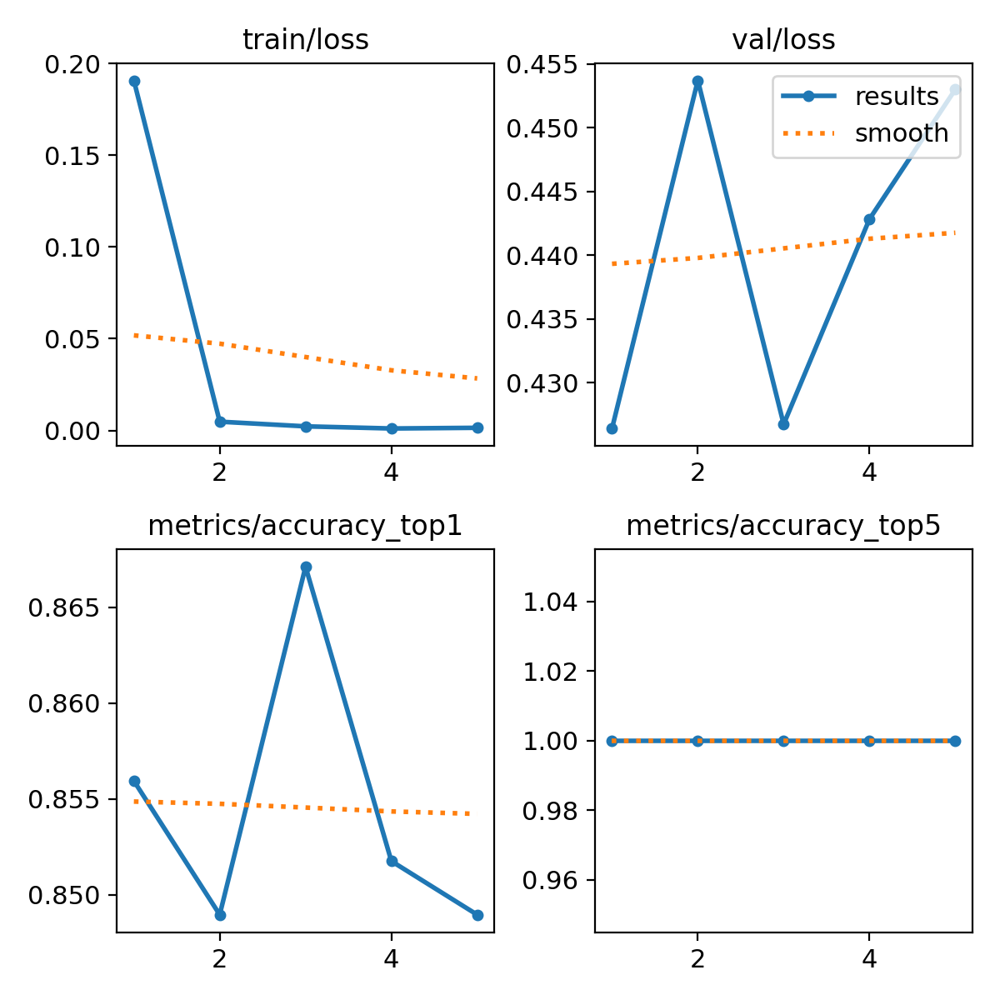
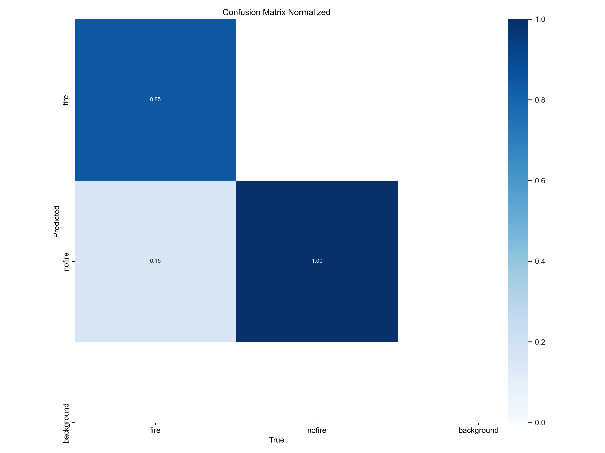
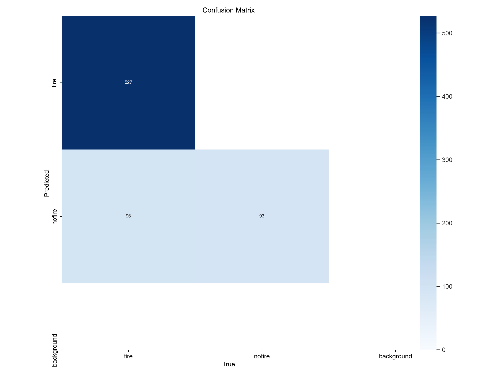

# Wildfire Classification 
The task at hand is to detect images that have current wildfires. For this project we took screenshots from public, live camera feeds that were recorded by ALERTCalifornia from two spots, Blue Ridge 1 and Santiago Peak 2.
We split out data into two classes in order to train our model, fire and no fire. We are using YOLO as our model in order to classify these images and future images from these
live camera feeds in order to automate the detection of possible wildfires. 

# Step 1: Gathering Data
We implemented a program called getData.py and ran it over a span of 10 hours to get enough data for both the cameras. This would take screenshots from a live camera feed every couple seconds. For ease of training and simplification we chose to only train and test our model on images taken during the day, as the camera were not made for night and all nighttime images were black and white. For our fire videos we found the same webcams that had fire from youtube and uploaded the images using another python script.
# Step 2: Training
To train our model we took out data and split it into test and train folders, both folders then had a sub devision of fire and no fire. Train is the images that we used to train our model with and Test is what we used to test out model. Train has 2200 images with fire and 328 without fire and out Test data has 628 images of fire and 94 without fire. 

Our model training code is in trainModel.py. For our model we API we used YOLOv8. 

We trained the model 5 seperate times for epocs all with around 85% accuracy. 

**Here are the outputs that we got:**





# How To Run 
In order to run our program you need to make sure to get set up in a virtual enviornment and download the requirements. 

```
pip install -r requirements.txt
```
 
To train a model using the dataset in the /Images folder, run the below command from the root folder
 ```
 python trainModel.py
 ```

 The output will be stored in the ./runs/classify/train4/ folder

# Conclusion 
In our model we had to use videos from previous fires due to the fact that California is not in wildfire season at the moment. The images that we used for fire detection contained either fire and/or smoke. In the future it is possible for us to continue to develop the model to the point where it could constantly scan the live feeds to check for fire detection 24/7, this would automate the process of looking for a wildfire in the ALERTCalifornia faster and make detection much quicker which could ultimatley lead to helping put the fire out before it does a lot of damage. 
